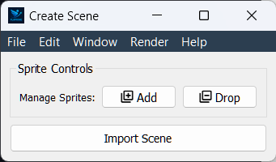
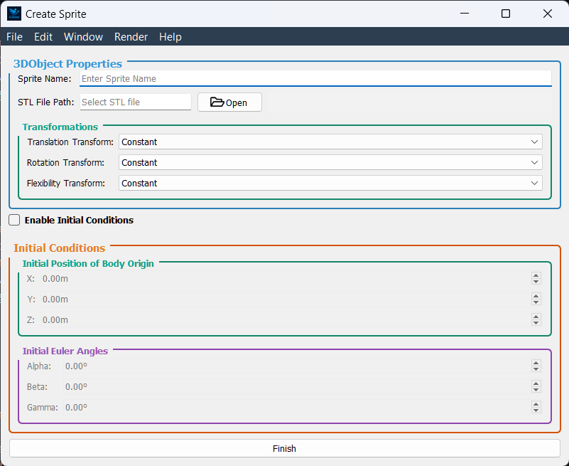
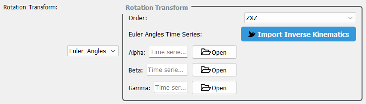
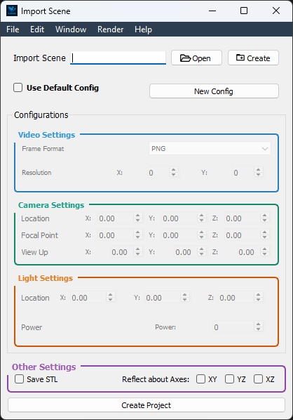
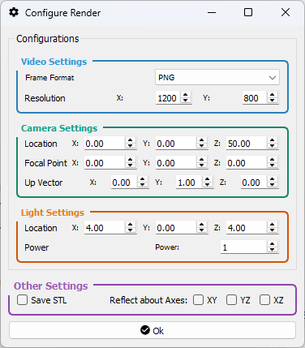

# Flapkine

**Flapkine** is a modular, high-performance PyQt5-based application for 3D inverse kinematics visualization and animation control — built for researchers, roboticists, and engineers who need **precision**, **control**, and **speed** in one sleek GUI.

<p align="left">
  
</p>

---

## 🔧 Features

- 🧠 **Inverse Kinematics Engine** — Compute and visualize 3D joint trajectories using custom analytical models.
- 🎮 **Interactive Animation Playback** — Control timelines, playback speed, and rendering in real time.
- 🧭 **STL Mesh Visualization** — Import and display STL files with real-time transformation tracking.
- 🛠️ **Project Setup Panel** — Configure video, camera paths, STL export, lighting, and reflections.
- 💾 **Video Export** — Export animations as high-quality JPEG sequences.
- ⚡ **Optimized Performance** — Built on VTK + PyQt5 with multithreaded rendering for speed.

---

## 📥 Installation

### 🔹 Option A: Windows Installer

Download the latest release from the [Releases Page](https://github.com/ihdavjar/FlapKine/releases) and run the installer. This will install Flapkine on your system with optional desktop shortcuts.

---

### 🔹 Option B: Developer Mode (Python)

1. **Clone the Repository:**

   ```bash
   git clone https://github.com/your-username/flapkine.git
   cd FlapKine
   ```
2. **(Optional but Recommended) Create a Virtual Environment:**

   ```bash
   python -m venv venv
   ```
3. **Activate the Virtual Environment:**

   <details>
    <summary><strong>Windows PowerShell</strong></summary>

   ```powershell
   .\venv\Scripts\Activate.ps1
   ```

   </details>

   <details>
    <summary><strong>Windows CMD</strong></summary>

   ```cmd
   venv\Scripts\activate.bat
   ```

   </details>

   <details>
    <summary><strong>macOS / Linux</strong></summary>

   ```bash
   source venv/bin/activate
   ```

   </details>
4. **Install Required Dependencies:**

   ```bash
   pip install -e.
   ```
5. **Launch the Application:**

   ```bash
   python -m FlapKineLauncher.py
   ```

> **Tip:** You can deactivate the virtual environment at any time by typing `deactivate`.

---

## 🚀 User Guide: Flapkine

Welcome to **Flapkine**, your GUI-based platform for 3D kinematic visualization and point tracking on STL models. This guide walks you through launching the application, managing projects, and understanding key features.

---

### 🧭 1. Launching the Application

When you launch **Flapkine**, the **Main Window** appears.

You can either:

- 🔓 **Open an Existing Project**
- 🆕 **Create a New Project**

➡️ *For details on components in this interface, see [🔎 Main Window](#main-window).*

---

### 📂 2. Opening an Existing Project

To load a saved project:

1. Click **Open Project**.
2. Select your **project directory**.
3. The app loads:
   - Your **STL model**
   - Saved **camera, lighting, and render settings**
   - Rendered animation (if available)

You’ll be redirected to the **Project Editor Window**.  
➡️ *See [🔎 Project Editor Window](#project-editor-window) for layout, features, and tools.*

#### ⚙️ Rendering Options

- ✅ **Auto Load**: Loads previous animation if available.
- 🧮 **Manual Render**: Click the **Render** button to generate animations.
- ⚡ Features:
  - In-situ memory rendering (no disk I/O bottlenecks)
  - Multithreading using `QThreadPool`
  - High-performance VTK pipeline
  - Non-essential UI widgets are disabled during rendering

➡️ *For render configuration options, see [🎛️ Render Configuration](#render-configuration).*

*(For more details see [🎛️ Render Configuration](####main-window))*

---

### 🆕 3. Creating a New Project

To create a new project:

1. Click **New Project**.
2. Choose a **project directory** and name.
3. You’ll enter the **Project Creator Window**.  
   ➡️ *Details: [🔎 Project Creator Window](#project-creator-window)*

Steps:

4. **Scene Setup**:
   - 📁 Import existing scene **OR**
   - ✨ Create a new scene  
     ➡️ *See [🎬 Creating a Scene](#creating-a-scene)*

5. **Render Settings**:
   - ✅ Load default settings (via checkbox)
   - ⚙️ Customize manually if needed  
     ➡️ *See [🎛️ Render Configuration](#render-configuration)*

6. Hit **Create Project** to proceed to the **Project Editor Window**.

---

### 🏗️ 4. Creating a Scene

To create a new scene:

1. In the **Project Creator Window**, click **Create** under Scene.
2. You’ll be redirected to the **Scene Creator Window**.  
   ➡️ *See [🔎 Scene Creator Window](#scene-creator-window)*

Steps:

3. Add or drop `Sprites` via the dropdown.
4. You may:
   - Load existing `Sprite` files
   - Or create new ones  
     ➡️ *See [🧩 Creating a Sprite](#creating-a-sprite)*

---

### 🧩 5. Creating a Sprite

To define a new `Sprite`:

1. In the **Scene Creator Window**, click **Add Sprite**.
2. Under the `Sprite`, click **Create**.
3. The **Sprite Creator Window** opens.  
   ➡️ *See [🔎 Sprite Creator Window](#sprite-creator-window)*

Components:

- Section 1: `3DObject` properties
- Section 2: Initial orientation settings

---

### 🔎 6. Windows Overview

Here are all the interface windows used in Flapkine. Each has a dedicated section:

| Window | Description |
|--------|-------------|
| [Main Window](#main-window) | Entry point for opening or creating projects |
| [Project Editor Window](#project-editor-window) | View STL, select points, preview animations |
| [Project Creator Window](#project-creator-window) | Setup scenes, adjust render settings |
| [Scene Creator Window](#scene-creator-window) | Compose scenes using sprites |
| [Sprite Creator Window](#sprite-creator-window) | Define object properties and orientation |
| [InverseKinematics Window](#inverse-kinematics-window) | For solving IK problems |

---


<details>
<summary><strong>🪟 Window Reference Sections</strong></summary>

#### 🪟 Main Window
<p align="center">
  
</p>

> The **Main Window** acts as the home screen for **FlapKine**
- **Open Project** button — Launches the project creation interface.
- **New Project** button — Opens an existing project from your local filesystem.
---

#### 🪟 Project Editor Window

<p align="center">
  
</p>

> The **Project Editor** serves as the heart of FlapKine, where users interact with STL scenes, fine-tune animations, and analyze motion data via integrated visualization tools.

---

**Interface Overview**

| **Section**             | **Purpose**                                                          |
|-------------------------|----------------------------------------------------------------------|
| 🎥 **Video Preview**     | Renders and displays the animation preview                           |
| 🧊 **3D Visualizer**     | Plays the STL model animation interactively                          |
| 🎯 **Point Selector**    | Enables precise 2D point selection on model surfaces                   |
| 📊 **Scatter Plot**      | Illustrates the 3D motion trajectory of selected points                |

---

**Video Preview Widget**

- **Overview:**  
  Automatically shows the rendered animation if available. Otherwise, users can render the animation using the Render button.
  
- **Key Features:**  
  - **Render Trigger:** Initiates the animation render if it hasn't been completed.  
  - **Status Bar:** Displays real-time rendering progress beside the Render button.  
  - **Configurable Rendering:** Adjust render settings via the `Render → Configure Render` menu.

---

**3D Visualizer Widget**

- **Overview:**  
  Renders the STL model in motion, providing an interactive 3D experience.
  
- **Key Features:**  
  - **Interactive Controls:** Rotate, zoom, and pan using the mouse.  
  - **Playback Controls:** Play, pause, or scrub through the animation timeline.  
  - **Visualization Aid:** Helps set camera and lighting configurations for the final video render.  
  - **Coordinate Axes:** Displays both body-fixed axes (A, B, C) and inertial axes (X, Y, Z).

---

**Point Selector Widget**

- **Overview:**  
  Optimized for components like wings where one dimension is significantly smaller; it provides a 2D projection by excluding the smallest axis.
  
- **Key Features:**  
  - **Flattened Projection:** Automatically adjusts to produce a 2D view for easier point selection.  
  - **Adaptive Interface:** Works intelligently for both wing-like structures and other object geometries.

---

**Scatter Plot Widget**

- **Overview:**  
  Uses computed forward kinematics to plot the 3D motion of the selected point with respect to the inertial coordinate system (X, Y, Z).

- **Key Features:**  
  - **Trajectory Tracking:** Visualizes the motion path in 3D space over time.  
  - **Dynamic Analysis:** Ideal for examining oscillations, vibrations, and deformation patterns.  
  - **Inertial Axes Reference:** The plot is aligned with the inertial axes (X, Y, Z), providing a global frame of reference for motion.

---

#### 🪟 Project Creator Window

<p align="center">
  
</p>

> Kick off your FlapKine projects by setting up the scene and render parameters.

---

**Scene Setup**

- **Create New Scene**  
  Initialize a fresh `.pkl` scene from scratch.
- **Import Scene**  
  Load an existing `.pkl` scene file into the project.

---

**Render Configuration**

- **Load Default Settings**  
  - Toggle **“Load Default Render Settings”** to apply FlapKine’s recommended parameters automatically.  
  - Individual parameters remain editable if you want to fine‑tune.
- **New Render Configuration**  
  - Select this option to start with all render parameters set to zero.  
  - Manually adjust each field to craft a custom setup.  

> _See the Render Configuration section for detailed explanations of each parameter._

---

**Create Project**

1. Confirm your scene selection and render settings.  
2. Click **Create Project**.  
3. FlapKine will generate your project folder, write the config and data files, then open the **Project Editor Window** for further work.


---

#### 🪟 Scene Creator Window

<p align="center">
  
</p>

> Assemble your scene by adding, ordering, and configuring individual sprites.

---

**What Is a Scene?**  
A **Scene** is a collection of **Sprites** (2D/3D objects) that together form the visual environment for your project. Each **Sprite** can be:
- **Imported** from an existing `.pkl` file  
- **Created** on the fly via the **Sprite Creator Window**

---

**Adding Sprites**

1. **Add Sprite**  
   Click the **+ Add** button to append a new sprite entry to the list.

2. **Drop Sprite**  
   Select an existing sprite in the list, then click the **– Drop** button to remove it.

3. **Import Sprite**  
   Click **Open** to browse your file system and load a `.pkl` sprite file.

4. **Create Sprite**  
   Click **Create** to launch the **Sprite Creator Window**, where you can design and save a brand‑new sprite.


---

**Finalizing Your Scene**  
- Once your sprite lineup is complete, click **Import Scene**.  
- The assembled scene is passed back to the **Project Creator Window** for render configuration and project setup.  


---

#### 🪟 Sprite Creator Window

<p align="center">
  
</p>

> Define individual sprites by configuring their geometry, transforms, and initial placement in 3D space.

---

**3D Object Configuration**

- **Name**  
  Enter a unique identifier for your 3D object.

- **STL File**  
  Click **Browse** to select the `.stl` mesh file from disk. Once loaded, the built‑in visualizer renders the object with overlapping **Body Axes** (A, B, C) and **Inertial Axes** (X, Y, Z), showing their initial alignment.

- **Transforms**  
  Choose how the object will move or deform during animation:
  - **Translation**: Select a preset (e.g., _Constant_, _Linear_).  
  - **Rotation**: Select a preset (e.g., _Constant_, _Euler Angles_, _Free_).  
  - **Flexibility**: Choose a deformation model (e.g., _Constant/Rigid_, _FlexibilityType1_, _FlexibilityType2_).

---

**Body Origin Position**

Adjust the origin of the body axes relative to the inertial frame by setting:

- **X Offset**  
- **Y Offset**  
- **Z Offset**  

All zeroes (`0, 0, 0`) will place the body origin exactly at the inertial origin. Any changes are reflected live in the visualizer.

---

**Body Orientation (Euler Angles)**

Set the initial orientation with right‑handed Euler angles (in degrees):

1. **α (Alpha)** – Rotation about the body’s A (roll) axis  
2. **β (Beta)** – Rotation about the body’s B (pitch) axis  
3. **γ (Gamma)** – Rotation about the body’s C (yaw) axis  

Adjusting these angles reorients the body axes in real time.

---

**Finalize Your Sprite**

When you’re satisfied with the 3D object parameters, origin position, and orientation, click **Finish**.  
This creates the sprite with your specified settings and returns you to the **Scene Creator Window**.

---

## Transform Reference

| **Transform Type**    | **Mode**           | **Description**                                                                                                                                                          | **Image**                                                                                  |
|-----------------------|--------------------|--------------------------------------------------------------------------------------------------------------------------------------------------------------------------|--------------------------------------------------------------------------------------------|
| **Translation**       | `Constant`         | No translation; the object remains fixed in place.                                                                                                                       | –                                                                                          |
|                       | `Linear`           | Applies a time-dependent translation using the object's Center of Mass (COM) trajectory. CSV input of COM positions is used to move the object over time.               |                              |
| **Rotation**          | `Constant`         | No rotation; the object retains its original orientation.                                                                                                                | –                                                                                          |
|                       | `Euler_Angle`      | Time-dependent rotation using Euler angles. Choose sequence (e.g., ZYX) and provide α, β, γ as CSV, or use the **Import Inverse Kinematics** feature *(See the [Inverse Kinematics](#inverse-kinematics) section for more details.)*.                  |                             |
| **Flexibility**       | `Constant / Rigid` | No deformation; the object behaves as a rigid body.                                                                                                                      | –                                                                                          |
|                       | `FlexibilityType1` | *(Description to be added in future.)*                                                                                                                                   | –                                                                                          |
|                       | `FlexibilityType2` | *(Description to be added in future.)*                                                                                                                                   | –                                                                                          |

---

#### 🪟 Inverse Kinematics Window

<p align="center">
  
</p>

The **Inverse Kinematics Window** is designed to extract time‐series Euler angles from your wing’s 3D point data. Follow these steps to import, visualize, and export your kinematics:

---

1. Import 3D Point Data

- Prepare a CSV file with columns:  
  `time, Ax, Ay, Az, Bx, By, Bz, Cx, Cy, Cz, Dx, Dy, Dz`  
  where A, B, C, D are the four points on the wing plane.
- Click **Import Data** and select your CSV.  
- The 3D coordinates are reconstructed using the Direct Linear Transformation (DLT) algorithm (see reference below).

<p align="center">
  
</p>

---

2. Choose Euler Sequence

- In the **Euler Order** dropdown, pick your desired rotation sequence (e.g., `ZYX`, `XYZ`, etc.).  
- This order determines how α (alpha), β (beta), and γ (gamma) are computed.

---

3. Visualize Point Trajectories

- On the **Left Panel**, select point **A**, **B**, **C**, or **D** to see its 3D trajectory plot over time.  
- Use this to verify tracking accuracy before computing angles.

---

4. Compute & Preview Euler Angles

- Once the sequence is selected, the window auto‐calculates α, β, γ at each timestamp.  
- Real‐time line plots appear below the 3D view for each angle component.

---

5. Export to Sprite Creator

- When you’re satisfied with the results, click **Finish**.  
- The computed Euler angles and selected sequence are sent directly to the **Sprite Creator Window** for further processing.

---

References

- **DLT (Direct Linear Transformation)** – A standard method for reconstructing 3D coordinates from multi‐camera stereo views.

---

</details>

<details>
<summary><strong>🎛️ Render Configuration</strong></summary>

#### 🪟 Render Settings Window

Access the Render Settings Window either during **New Project** creation or via **Render → Configure Render** in the **Project Editor**.

| **Window**            | **Description**                                                                                                                                                                                           | **Preview**                                                                                                           |
|-----------------------|-----------------------------------------------------------------------------------------------------------------------------------------------------------------------------------------------------------|-----------------------------------------------------------------------------------------------------------------------|
| **Project Creator**   | Configure render options as you set up a new project. Adjust video format, resolution, camera placement, lighting, and output settings before creation.                                                  |  |
| **Project Editor**    | Re‑open and tweak render settings on an existing project. All parameters—video format, camera, light, STL export, and reflection—can be modified without restarting the project workflow.               |     |

---

##### 1. Video Settings  
- **Frame Format**: Select image format for each frame (e.g., PNG, JPEG).  
- **Resolution**: Define output resolution (width × height) for video frames.

##### 2. Camera Settings  
- **Location**: Specify camera position in the global X, Y, Z axes.  
- **Rotation**: Define camera orientation via rotation angles about X, Y, Z.

##### 3. Light Settings  
- **Position**: Set light source coordinates in X, Y, Z.  
- **Power**: Adjust light intensity to illuminate the scene.

##### 4. Other Options  
- **STL Export**: Enable “Save STL per Frame” to output geometry snapshots for CFD or post‑processing.  
- **Reflection Plane**: Choose XY, YZ, or XZ for automatic mirroring—useful for paired wing simulations without duplicating sprite definitions.

</details>

## 📚 Documentation

Full API and user documentation is available at:
[https://ihdavjar.github.io/FlapKine](https://ihdavjar.github.io/FlapKine)

## Acknowledgements
