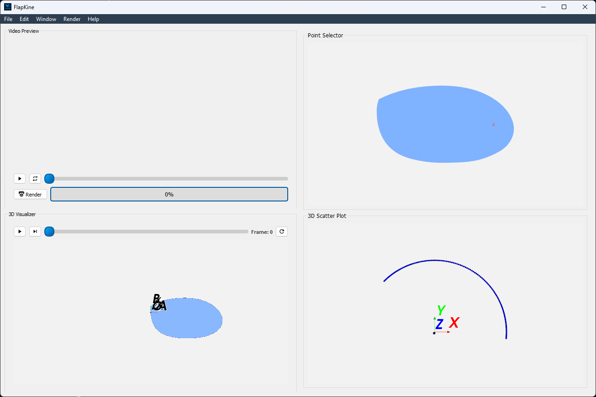
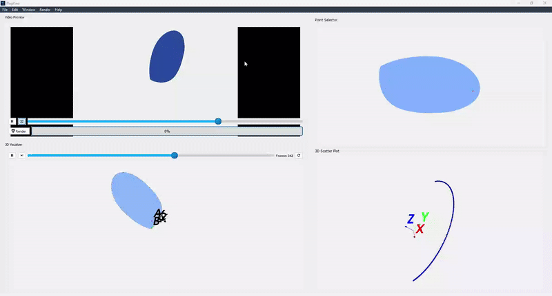

.. _1_dof_1:

1-DOF flapping wing
===================

This example demonstrates a **1-DOF flapping wing kinematic system**. It guides you through the project setup, resource files, and visualization steps to reproduce the results.

Overview
--------

This example simulates a wing structure undergoing:

- **Rotation** about a single axis (`z`-axis)
- **Visualization** of a 3D wing mesh loaded from an STL file

It includes all necessary configuration settings, time-varying angle inputs, and STL required to run and reproduce the simulation in **FlapKine**.

Files Included
--------------

- **`project.zip`**: A compressed archive containing both the full simulation project and the necessary resource files.

Upon extraction, the contents of `project.zip` are organized into two main folders:

- **`1_DOF_1/`**: Contains the actual project setup, which can be loaded into FlapKine.
- **`resources/`**: Contains supporting files required for Reproducing the project from scratch, such as STL meshes, angles time series, and plots.

Project Folder Structure
------------------------

The `1_DOF_1/` folder includes the following::

    1_DOF_1/
    ├── scene.pkl          # Scene Class object saved as a pickle file
    ├── config.json        # Configuration file with simulation and rendering settings
    └── data/              # Output directory for generated frames or videos

Resource Files
--------------

The `resources/` folder contains the required data for kinematic input and visualization::

    resources/
    ├── angles/
    │   ├── alpha_data.csv    # Rotation about the x-axis (all zeros)
    │   ├── beta_data.csv     # Rotation about the y-axis (all zeros)
    │   └── gamma_data.csv    # Rotation about the z-axis (time-series values)
    │
    ├── stl/
    │   └── wing.stl          # 3D mesh of the wing
    │
    └── angle_plot.png        # Plot of the rotation angles over time

Initial STL Orientation
-----------------------

The `wing.stl` model is oriented such that:

- The **x-axis** aligns with the wing span (length).
- The **y-axis** aligns with the wing chord (width).
- The **z-axis** corresponds to the wing thickness.

Simulation Details
------------------

This is a **single degree-of-freedom** system, where only the rotation about the **z-axis** (`gamma_data.csv`) is active. The `alpha` and `beta` (which can be also seen by visualising the angles using .csv files in ressource) angles are zero throughout the simulation. Below is a plot showing the time-series data for each rotation angle given in the `angles/` folder:

.. figure:: 1_DOF_1/angles_plot.png
   :align: center
   :width: 80%
   :alt: Angle Plot

   **Figure:** Time-series plot of the rotation angles (`alpha`, `beta` & `gamma`) used in this example.

Running the Example
-------------------

1. Extract the `project.zip` archive to your desired directory.

2. Launch the **FlapKine** application and select **Load Project**.

3. Navigate to the `1_DOF_1/` folder and choose the directory.

4. The project will load with a pre-configured scene. Below is a screenshot of the loaded project:

    **Figure:** Screenshot of the project loaded in **FlapKine**.

5. The project folder does not include the rendered video by default. To generate it, click on the **Render** button in the GUI. The simulation will be rendered and the output video saved under `data/videos/`.

   .. note::

      See the :ref:`Project Editor Window <project_editor_window>` section for more details about the GUI and its functionality.

Below is a short preview showcasing the rendered simulation output for this example:

   **Figure:** Rendered simulation preview after completing the scene setup and clicking the **Render** button in **FlapKine**.

For higher quality or longer playback, you can render a full-resolution `.mp4` video directly using the **Render** button. The video will be saved automatically in the `data/videos/` folder within your project directory.

Reproducing from Scratch
------------------------

To manually recreate the above project from scratch:

1. Open **FlapKine** and select **New Project**.

2. Choose your desired destination folder, enter a project name, and click **Save**.

3. The :ref:`Project Creator Window <project_creator_window>` will open. This is where you can import ``Scene`` and change rendering configurations.

   .. figure:: 1_DOF_1/project_creator.png
      :align: center
      :width: 45%
      :alt: Project Creator Screenshot

      **Figure:** Screenshot of the project creator window in **FlapKine**.

4. Start by loading the default rendering configuration:

   - Toggle the **Use Default Config** option.
   - For this example, since the rotation is about the z-axis, set the camera view accordingly:

     - **Camera Position:** (0, 0, 50)

     - **Focal Point:** (0, 0, 0)

     - **Up Vector:** (0, 1, 0)

     - **Light Source Position:** (0, 0, 20)

     - **Light Energy:** 1

   - Enable **STL** saving if needed.

   .. figure:: 1_DOF_1/config.png
      :align: center
      :width: 45%
      :alt: Configuration Screenshot

      **Figure:** Rendering configuration settings in **FlapKine**.

5. To add a model to the scene, click the **Create** button under the **Import Scene** section. This opens the :ref:`Scene Creator Window <scene_creator_window>`.

   .. figure:: 1_DOF_1/scene_creator.png
      :align: center
      :width: 45%
      :alt: Scene Creator Screenshot

      **Figure:** Scene creator window in **FlapKine**.

6. Click **Add** to insert a new ``Sprite``.

7. In the **Sprite 1** section, click **Create**. This opens the :ref:`Sprite Creator Window <sprite_creator_window>`.

8. In the **Sprite Creator**:

   - Assign a name to your ``3DObject``.
   - Load the STL file from the `resources/` directory.

   .. figure:: 1_DOF_1/sprite_creator.png
      :align: center
      :width: 100%
      :alt: Sprite Creator Screenshot

      **Figure:** STL file loaded and Transformation set in the sprite configuration.

9. In the **Transformation** section:

   - Set the **Rotation Transform Type** to `Euler_angles`
   - Set the **Order** to `ZYX`
   - For **Angle 1**, load `gamma_data.csv`, `beta_data.csv` and `alpha_data.csv` from the resource folder

10. Once configuration is complete, click **Finish**. You’ll return to the :ref:`Scene Creator Window <scene_creator_window>` where the new sprite will appear in green, indicating success.

11. Click **Import Scene** to finalize the scene. You’ll be redirected back to the :ref:`Project Creator Window <project_creator_window>`, with the **Create Scene** button now showing green.

12. Finally, click the **Create Project** button. This will generate the same project structure and configuration as in the original `1_DOF_1/` folder provided in `project.zip`.

.. rubric:: Download

Get the resource from: `Download Link <https://github.com/ihdavjar/FlapKine/raw/refs/heads/main/examples/1_DOF_1/project.zip?download=>`_