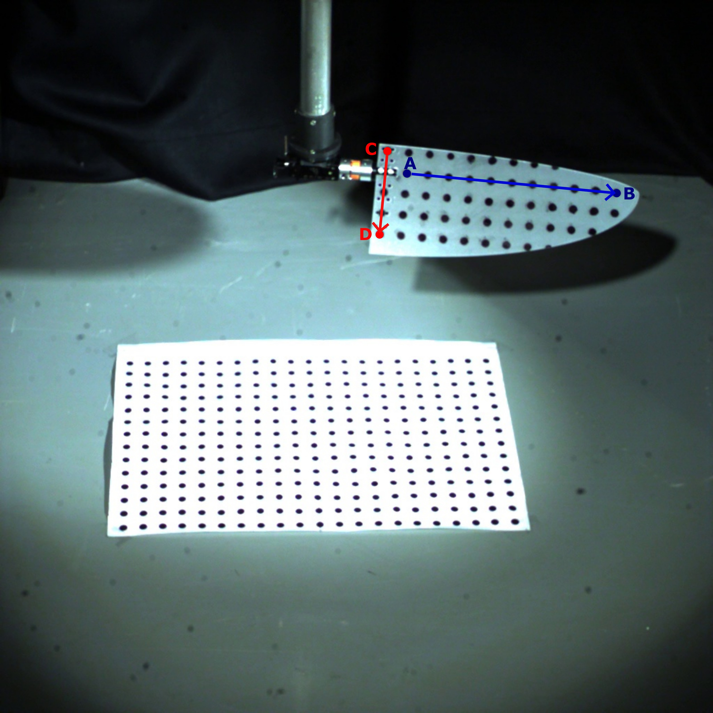
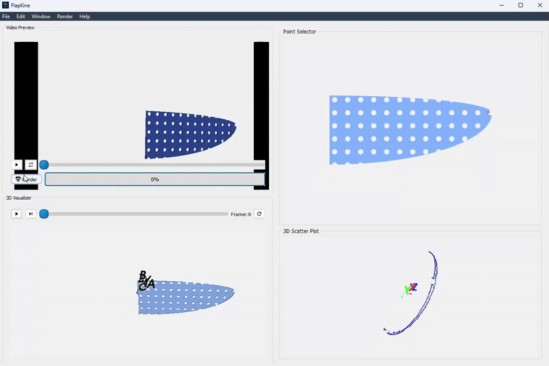
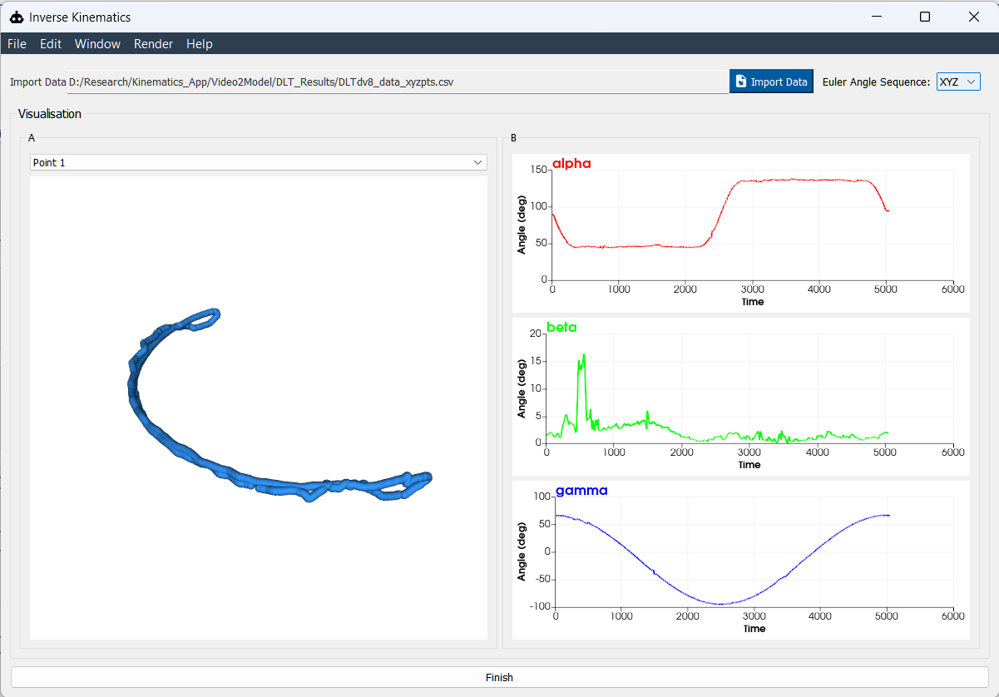

.. _2_DOF_INV:

2-DOF Inverse Kinematics
=========================

This example demonstrates how to use inverse kinematics (IK) for a flapping wing system with two rotational degrees of freedom (DoF).

Using **FlapKine**, the goal is to calculate the Euler angles required to reproduce a desired wing motion. The target motion is first captured using a multi-view stereo camera setup, which provides accurate 3D wing positions.

.. note::
   Multi-view stereo processing is not currently built into **FlapKine**, but future versions aim to include native support for it.

At present, we use **DLTdv** [#DLTdv]_ to process video recordings and generate 3D positional data. **FlapKine** then takes this data as input and computes a time series of Euler angles needed to recreate the wing motion through inverse kinematics.

This workflow highlights how **FlapKine** serves as a powerful tool for post-processing and analyzing real-world motion capture data using analytical IK models.

Overview
--------

In this example, the wing structure undergoes:

- **Rotation** about two orthogonal axes: the `z`-axis and the `x`-axis.

To compute the Euler rotation angles, we select two pairs of points on the wing:

- Two points along the **wing span** to define the body-frame `x`-axis.
- Two points along the **wing chord** to establish the orientation in 3D space.

These specific points (A, B, C, D) are marked on the wing as shown in the image below. They are manually tracked frame-by-frame using **DLTdv**.

After tracking, the 2D point data is converted into 3D coordinates using DLTdv's calibration. The result is stored in a frame-wise format as shown below:

.. code-block:: text

   Ax, Ay, Az, Bx, By, Bz, Cx, Cy, Cz, Dx, Dy, Dz
   1.23, 4.56, 7.89, 2.34, 5.67, 8.90, 3.45, 6.78, 9.01, 4.56, 7.89, 0.12
   1.25, 4.58, 7.91, 2.36, 5.69, 8.92, 3.47, 6.80, 9.03, 4.58, 7.91, 0.14
   ...

Each row represents a single time frame and includes:

- **Ax, Ay, Az**: 3D coordinates of point A
- **Bx, By, Bz**: 3D coordinates of point B
- **Cx, Cy, Cz**: 3D coordinates of point C
- **Dx, Dy, Dz**: 3D coordinates of point D

These markers correspond to the labeled points in the image below, used to define body orientation and compute IK-based Euler angles.

Files Included
--------------

- **`project.zip`**: A compressed archive containing the full simulation setup and all necessary resource files.

After extracting, the contents are organized into the following directories:

- **`2_DOF_INV/`** – Contains the FlapKine project configuration and execution setup.
- **`resources/`** – Includes supporting assets such as STL meshes, camera videos, calibration data, and tracked 3D coordinates.

Project Folder Structure
------------------------

The `2_DOF_INV/` directory contains the core FlapKine project files:

.. code-block:: none

   2_DOF_INV/
   ├── scene.pkl          # Serialized Scene object containing the simulation setup
   ├── config.json        # Configuration file for rendering and simulation parameters
   └── data/              # Directory where output frames and videos are generated

Resource Files
--------------

The `resources/` directory contains all the data used to reconstruct and analyze the wing motion:

.. code-block:: none

   resources/
   ├── videos/
   │   ├── view_1.mp4                  # Wing motion video from camera 1
   │   └── view_2.mp4                  # Wing motion video from camera 2
   │
   ├── camera_calibration/
   │   ├── calibration_cube/
   │   │   ├── view_1.jpg              # Image of calibration object from camera 1
   │   │   ├── view_2.jpg              # Image of calibration object from camera 2
   │   │   └── cube_dimensions.jpg     # Reference image showing cube dimensions
   │   └── calibration_matrix.csv      # Computed stereo calibration matrix
   │
   ├── stl/
   │   └── wing.stl                    # 3D mesh of the wing model
   │
   └── dlt_results/
       └── 3d_positions.csv            # Tracked 3D coordinates of wing markers (A–D)

Initial STL Orientation
-----------------------

The `wing.stl` model is oriented such that:

- The **x-axis** aligns with the wing span.
- The **y-axis** aligns with the wing chord.
- The **z-axis** corresponds to the wing thickness.

Running the Example
-------------------

1. Extract the `project.zip` archive to your desired directory.

2. Launch **FlapKine** and select **Load Project**.

3. Navigate to the `2_DOF_INV/` folder and open the project.

4. The project will load with the pre-configured scene.

5. To visualize the simulation, click on the **Render** button. The output video will be saved under `data/videos/`.

   .. note::

      For detailed information on the GUI functionalities, refer to the :ref:`Project Editor Window <project_editor_window>` section.

Below is a preview of the rendered simulation output:

   **Figure:** Rendered simulation preview after executing the inverse kinematics setup in **FlapKine**.

For higher quality or longer playback, you can render a full-resolution `.mp4` video directly using the **Render** button. The video will be saved automatically in the `data/videos/` folder within your project directory.

Reproducing from Scratch
------------------------

To manually recreate the above project from scratch:

1. Open **FlapKine** and select **New Project**.

2. Choose your desired destination folder, enter a project name, and click **Save**.

3. The :ref:`Project Creator Window <project_creator_window>` will open. This is where you can import ``Scene`` and change rendering configurations.

   .. figure:: 1_DOF_1/project_creator.png
      :class: dark-compatible-image
      :align: center
      :width: 45%
      :alt: Project Creator Screenshot

      **Figure:** Screenshot of the project creator window in **FlapKine**.

4. Start by loading the default rendering configuration:

   - Toggle the **Use Default Config** option.

   - You may change the configuration settings according to your desire. However default config works with this project.

   - Disable **Reflect**

   .. figure:: 2_DOF_INV/config.png
      :class: dark-compatible-image
      :align: center
      :width: 45%
      :alt: Configuration Screenshot

      **Figure:** Rendering configuration settings in **FlapKine**.

5. To add a model to the scene, click the **Create** button under the **Import Scene** section. This opens the :ref:`Scene Creator Window <scene_creator_window>`.

   .. figure:: 1_DOF_1/scene_creator.png
      :class: dark-compatible-image
      :align: center
      :width: 45%
      :alt: Scene Creator Screenshot

      **Figure:** Scene creator window in **FlapKine**.

6. Click **Add** to insert a new ``Sprite``.

7. In the **Sprite 1** section, click **Create**. This opens the :ref:`Sprite Creator Window <sprite_creator_window>`.

8. In the **Sprite Creator**:

   - Assign a name to your ``3DObject``.
   - Load the STL file from the `resource/stl` directory.

   .. figure:: 2_DOF_INV/sprite_creator.png
      :class: dark-compatible-image
      :align: center
      :width: 100%
      :alt: Sprite Creator Screenshot

      **Figure:** STL file loaded and Transformation set in the sprite configuration.

9. In the **Transformation** section:

   - Set the **Rotation Transform Type** to `Euler_angles`

   - Press the blue coloured inverse kinematics button, to open the :ref:`Inverse Kinematics Window <inverse_kinematics_window>`

   - In the :ref:`Inverse Kinematics Window <inverse_kinematics_window>` choose the data in directory `resources/dlt_results/`.

   - Alternatively here can also use the videos provided to compute the 3D positions independently using software like DLTdv.

   - However the project has this given to not make the process more cumbersome.

   - After getting the data choose the order as `XYZ` this should give the proper calculated euler angles, you can also watch the time series of these angles in the right half plane.

   - In the left half plane you can visualise the trajectory of each of the four points.A B C D.

   - Once you are done press the finsh button.

   - This would add the angles time automatically to :ref:`Sprite Creator Window <sprite_creator_window>`.

         **Figure:** 3D position data loaded into Inverse kinematics window.

10. Once configuration is complete, click **Finish**. You’ll return to the :ref:`Scene Creator Window <scene_creator_window>` where the new sprite will appear in green, indicating success.

11. Click **Import Scene** to finalize the scene. You’ll be redirected back to the :ref:`Project Creator Window <project_creator_window>`, with the **Create Scene** button now showing green.

12. Finally, click the **Create Project** button. This will generate the same project structure and configuration as in the original `2_DOF_INV/` folder provided in `project.zip`.

.. rubric:: References

.. [#DLTdv] Ty Hedrick. *DLTdv: A MATLAB-based tool for 2D video digitizing and 3D reconstruction*.
   Available at: https://biomech.web.unc.edu/dltdv/

.. rubric:: Download

Get the resource from: `Download Link <https://github.com/ihdavjar/FlapKine/raw/refs/heads/main/examples/2_DOF_INV/project.zip?download=>`_