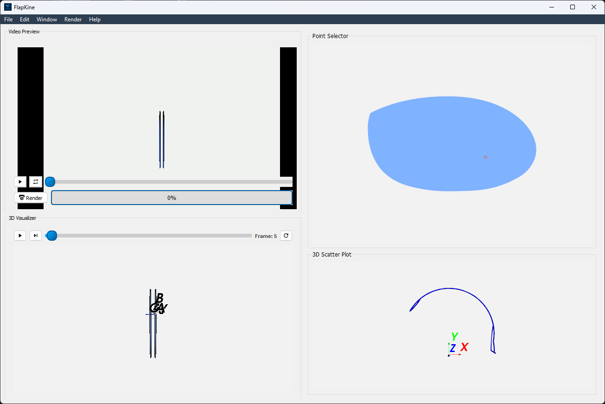
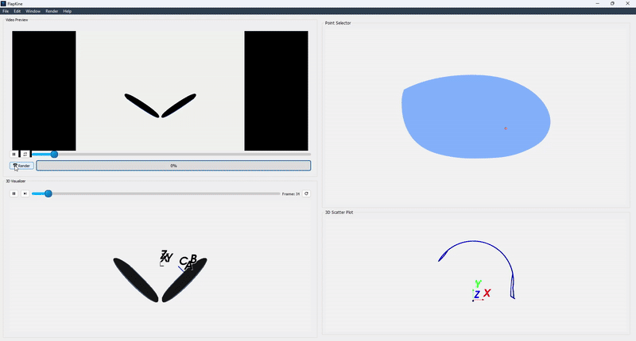

.. _2_DOF_Translation:

2-DOF + Translating Flapping Wing
=================================

Taking a step beyond the previous 1-DOF flapping wing system, this example introduces a 2-DOF rotational mechanism combined with a linear translation—resulting in a 5-DOF system (2 rotational + 3 translational). The goal is to demonstrate how more complex kinematics can be visualized using **FlapKine**.

.. note::
   We highly recommend reviewing the simpler example first: :ref:`1-DOF Flapping Wing <1_dof_1>` before attempting this walkthrough.

Overview
--------

This example simulates a wing structure undergoing:

- **Rotation** about two orthogonal axes (`z` and `x`)
- **Translation** along a linear axes (`x`, `y` and `z`)

The wing's kinematic data is driven by external CSV files containing time-dependent joint values. The mesh is loaded via STL, and the full 3D motion is rendered using **FlapKine**'s rendering pipeline.

Files Included
--------------

- **`project.zip`**: A compressed archive containing both the full simulation project and the necessary resource files.

Upon extraction, the contents of `project.zip` are organized into two main folders:

- **`2_DOF_Translation/`**: Contains the actual project setup, which can be loaded into FlapKine.
- **`Resource/`**: Contains supporting files required for Reproducing the project from scratch, such as STL meshes, joint angle data, and plots.

Project Folder Structure
------------------------

The `2_DOF_Translation/` folder includes the following::

    2_DOF_Translation/
    ├── scene.pkl          # Scene Class object saved as a pickle file
    ├── config.json        # Configuration file with simulation and rendering settings
    └── data/              # Output directory for generated frames or videos
Resource Files
--------------

The `Resource/` folder contains the required data for kinematic input and visualization::

    Resource/
    ├── angles/
    │   ├── alpha_data.csv    # Rotation about the x-axis (time series values)
    │   ├── beta_data.csv     # Rotation about the y-axis (all zeros)
    │   └── gamma_data.csv    # Rotation about the z-axis (time-series values)
    ├── origin_position/
    │   └── pos_data.csv      # Position of Body Origin (time-series values)
    ├── stl/
    │   └── wing.stl          # 3D mesh of the wing
    ├── angle_plot.png        # Plot of the rotation angles over time
    └── pos_plot.png          # Plot of the body origin position over time

Initial STL Orientation
-----------------------

The `wing.stl` model is oriented such that:

- The **x-axis** aligns with the wing span (length).
- The **y-axis** aligns with the wing chord (width).
- The **z-axis** corresponds to the wing thickness.

Simulation Details
------------------

This example demonstrates a **two rotational degree of freedom** system, where rotation about the **z-axis** and **x-axis** is active. The time-dependent rotation is defined by the file `gamma_data.csv` and `alpha_data.csv`, while the other rotational axis `beta` (y-axis)—remain zero throughout the simulation, which is specified by all zero `beta_data.csv`.

The corresponding plots below illustrate the time-series data used in the simulation:

.. figure:: 2_DOF_Translation/angles_plot.png
   :class: dark-compatible-image
   :align: center
   :width: 80%
   :alt: Rotation Angles Plot

   **Figure:** Time-series plot of the rotation angles (`alpha`, `beta`, and `gamma`). Only `gamma` (z-axis)  and `alpha` (x-axis) varies, while `beta` remain zero.

In addition to rotational motion, this example includes **translational motion** of the body frame origin, resulting in additional **three translation degree of freedom**. The position trajectories along the `X`, `Y`, and `Z` axes are provided as time-series data in the `origin_position/` folder.

.. figure:: 2_DOF_Translation/pos_plot.png
   :class: dark-compatible-image
   :align: center
   :width: 80%
   :alt: Position Plot

   **Figure:** Time-series plot of the translational positions (`X`, `Y`, and `Z`) of the body frame origin during the simulation.

Running the Example
-------------------

1. Extract the `project.zip` archive to your desired directory.

2. Launch the **FlapKine** application and select **Load Project**.

3. Navigate to the `2_DOF_Translation/` folder and choose the directory.

4. The project will load with a pre-configured scene. Below is a screenshot of the loaded project:

    **Figure:** Screenshot of the project loaded in **FlapKine**.

5. The project folder does not include the rendered video by default. To generate it, click on the **Render** button in the GUI. The simulation will be rendered and the output video saved under `data/videos/`.

   .. note::

      See the :ref:`Project Editor Window <project_editor_window>` section for more details about the GUI and its functionality.

Below is a short preview showcasing the rendered simulation output for this example:

   **Figure:** Rendered simulation preview after completing the scene setup and clicking the **Render** button in **FlapKine**.

For higher quality or longer playback, you can render a full-resolution `.mp4` video directly using the **Render** button. The video will be saved automatically in the `data/videos/` folder within your project directory.

Reproducing from Scratch
------------------------

To manually recreate the above project from scratch:

1. Open **FlapKine** and select **New Project**.

2. Choose your desired destination folder, enter a project name, and click **Save**.

3. The :ref:`Project Creator Window <project_creator_window>` will open. This is where you can import ``Scene`` and change rendering configurations.

   .. figure:: 1_DOF_1/project_creator.png
      :class: dark-compatible-image
      :align: center
      :width: 45%
      :alt: Project Creator Screenshot

      **Figure:** Screenshot of the project creator window in **FlapKine**.

4. Start by loading the default rendering configuration:

   - Toggle the **Use Default Config** option.
   - For this simulation, the optimal camera and lighting setup is:

     - **Camera Position:** (50, 0, 0)

     - **Focal Point:** (0, 0, 0)

     - **Up Vector:** (0, 0, 1)

     - **Light Source Position:** (30, 0, 0)

     - **Light Energy:** 1

   - Enable **Reflect** about the **XZ plane**.

     *(This reflection simulates a symmetrical, bird-like flapping motion. Alternatively, you can add multiple sprites—one for each wing—and animate them independently for finer control.)*

   .. figure:: 2_DOF_Translation/config.png
      :class: dark-compatible-image
      :align: center
      :width: 45%
      :alt: Configuration Screenshot

      **Figure:** Rendering configuration settings in **FlapKine**.

5. To add a model to the scene, click the **Create** button under the **Import Scene** section. This opens the :ref:`Scene Creator Window <scene_creator_window>`.

   .. figure:: 1_DOF_1/scene_creator.png
      :class: dark-compatible-image
      :align: center
      :width: 45%
      :alt: Scene Creator Screenshot

      **Figure:** Scene creator window in **FlapKine**.

6. Click **Add** to insert a new ``Sprite``.

7. In the **Sprite 1** section, click **Create**. This opens the :ref:`Sprite Creator Window <sprite_creator_window>`.

8. In the **Sprite Creator**:

   - Assign a name to your ``3DObject``.
   - Load the STL file from the `resource/stl` directory.

   .. figure:: 2_DOF_Translation/sprite_creator.png
      :class: dark-compatible-image
      :align: center
      :width: 100%
      :alt: Sprite Creator Screenshot

      **Figure:** STL file loaded and Transformation set in the sprite configuration.

9. In the **Transformation** section:

   - Set the **Translation Tranfrom Type** to `Linear`

   - For *position*, load `pos_data.csv` from `resource/origin_position` directory

   - Set the **Rotation Transform Type** to `Euler_angles`

   - Set the **Order** to `ZYX`

   - For **Angle 1**, load `gamma_data.csv`, for **Angle 2** load `beta_data.csv` and for **Angle 3** load `alpha_data.csv` from the resource folder

10. Once configuration is complete, click **Finish**. You’ll return to the :ref:`Scene Creator Window <scene_creator_window>` where the new sprite will appear in green, indicating success.

11. Click **Import Scene** to finalize the scene. You’ll be redirected back to the :ref:`Project Creator Window <project_creator_window>`, with the **Create Scene** button now showing green.

12. Finally, click the **Create Project** button. This will generate the same project structure and configuration as in the original `2_DOF_Translation/` folder provided in `project.zip`.

.. rubric:: Download

Get the resource from: `Download Link <https://example.com/your-download-link>`_