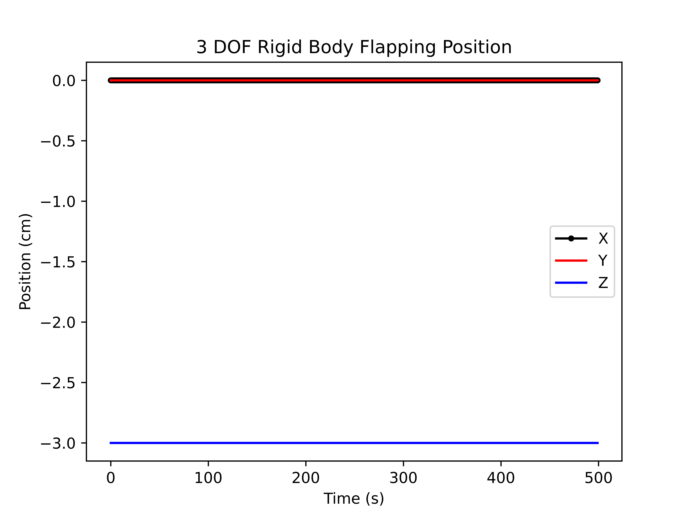
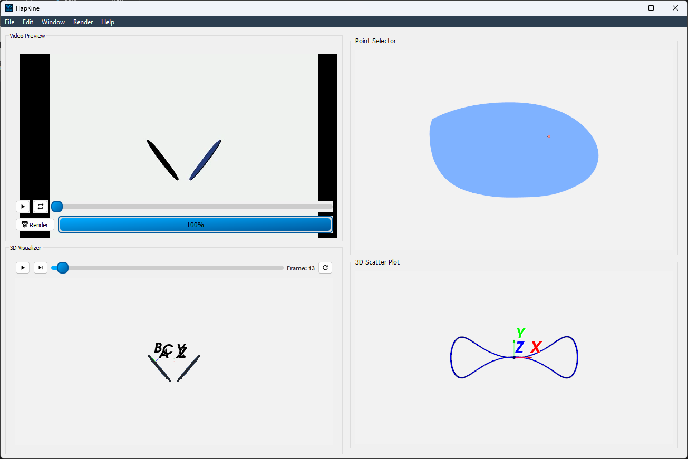
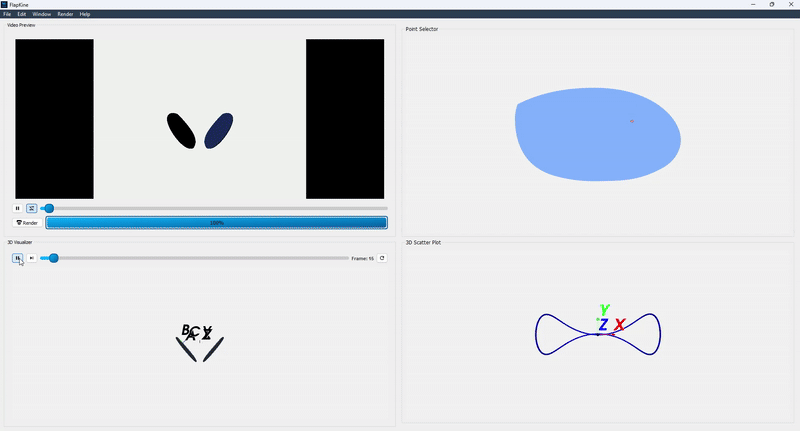

3-DOF Flapping Wing – Example 2
===============================

This example demonstrates a **3-DOF rotational mechanism** applied to a flapping wing system, showcasing how complex kinematic behaviors can be visualized using **FlapKine**.

The wing motion in this example is inspired by insect flight kinematics, adapted from a published model [#roccia2011]_.

.. note::
   The only thing that changes between :ref:`3-DOF Flapping Wing - Example 1 <3_dof_1>` are the angles time-series.
   We highly recommend reviewing the example 1 first: :ref:`3-DOF Flapping Wing - Example 1 <3_dof_1>` before attempting this walkthrough.

Overview
--------

This example simulates a wing structure undergoing:

- **Rotation** about three orthogonal axes (`z`, `y`, and `x`)

Although no actual translation occurs during the simulation, a **fixed linear translation** is applied to position the body frame origin at `(0, 0, -3)`. This constant offset ensures that the wing does not overlap with its mirrored counterpart when using the **Reflect** feature in FlapKine.

In biological systems such as insects, left and right wings are physically separated in space. To replicate this spatial arrangement and avoid mesh collision at the inertial origin `(0, 0, 0)`, we use this adjustment as a simple yet effective workaround. The time-series position data (`X`, `Y`, `Z`) reflects this fixed offset throughout the simulation.

Files Included
--------------

- **`project.zip`**: A compressed archive containing both the full simulation project and the necessary resource files.

Upon extraction, the archive is structured into the following directories:

- **`3_DOF_2/`**: Contains the full FlapKine project, ready to be loaded and rendered.
- **`Resource/`**: Contains STL meshes, joint angle CSVs, and supplementary plots used for verification or to reproduce the simulation manually.

Project Folder Structure
------------------------

The `3_DOF_2/` folder includes the following::

    3_DOF_2/
    ├── scene.pkl          # Scene Class object saved as a pickle file
    ├── config.json        # Configuration file with simulation and rendering settings
    └── data/              # Output directory for generated frames or videos

Resource Files
--------------

The `Resource/` folder contains the required data for kinematic input and visualization::

    Resource/
    ├── angles/
    │   ├── alpha_data.csv    # Rotation about the x-axis (time series values)
    │   ├── beta_data.csv     # Rotation about the y-axis (all zeros)
    │   └── gamma_data.csv    # Rotation about the z-axis (time-series values)
    ├── origin_position/
    │   └── pos_data.csv      # Position of Body Origin (time-series values with constant value in this case)
    ├── stl/
    │   └── wing.stl          # 3D mesh of the wing
    ├── angle_plot.png        # Plot of the rotation angles over time
    └── pos_plot.png          # Plot of the body origin position over time

Initial STL Orientation
-----------------------

The `wing.stl` model is oriented such that:

- The **x-axis** aligns with the wing span (length).
- The **y-axis** aligns with the wing chord (width).
- The **z-axis** corresponds to the wing thickness.

Simulation Details
------------------

This example demonstrates a **three rotational degree of freedom** system, where rotation about the **z-axis**, **y-axis**, and **x-axis** is active. The time-dependent rotation is defined by the files `gamma_data.csv`, `beta_data.csv`, and `alpha_data.csv`, which collectively describe the full 3D orientation of the flapping wing over time.

Although the system is purely rotational in its kinematic design, a constant positional offset is introduced through the translation files `X.csv`, `Y.csv`, and `Z.csv`. These contain fixed values (0, 0, -3) to shift the body frame origin downward. This offset ensures spatial separation between mirrored wings when using the **Reflect** option, avoiding overlap at the inertial origin `(0, 0, 0)`.

The corresponding plots below illustrate the time-series data used in the simulation:

.. figure:: 3_DOF_2/angles_plot.png
   :class: dark-compatible-image
   :align: center
   :width: 80%
   :alt: Rotation Angles Plot

   **Figure:** Time-series plot of the rotation angles (`alpha`, `beta`, and `gamma`) defining the wing’s orientation. All three rotational degrees of freedom are active in this simulation.

Although no actual motion occurs along the translational axes, the body frame origin is fixed at a constant offset of (0, 0, -3) using the translation CSV files. This static shift ensures mirrored wings do not collide at the inertial origin when **Reflect** is enabled.

   **Figure:** Time-series plot of the translational positions (`X`, `Y`, and `Z`) of the body frame origin. The constant values reflect the static positional offset applied throughout the simulation.

Running the Example
-------------------

1. Extract the `project.zip` archive to your desired directory.

2. Launch the **FlapKine** application and select **Load Project**.

3. Navigate to the `3_DOF_2/` folder and choose the directory.

4. The project will load with a pre-configured scene. Below is a screenshot of the loaded project:

    **Figure:** Screenshot of the project loaded in **FlapKine**.

5. The project folder does not include the rendered video by default. To generate it, click on the **Render** button in the GUI. The simulation will be rendered and the output video saved under `data/videos/`.

   .. note::

      See the :ref:`Project Editor Window <project_editor_window>` section for more details about the GUI and its functionality.

Below is a short preview showcasing the rendered simulation output for this example:

   **Figure:** Rendered simulation preview after completing the scene setup and clicking the **Render** button in **FlapKine**.

For higher quality or longer playback, you can render a full-resolution `.mp4` video directly using the **Render** button. The video will be saved automatically in the `data/videos/` folder within your project directory.

Reproducing from Scratch
------------------------

To recreate this project manually, follow the same reproduction steps outlined in :ref:`2-DOF + Translating Flapping Wing <2_DOF_Translation>`.
However, make sure to use the corresponding `resources` files provided with this 3-DOF example instead.

.. rubric:: References

.. [#roccia2011] Roccia, B., Preidikman, S., Massa, J., & Mook, D.
   *Development of a Kinematical Model to Study the Aerodynamics of Flapping-Wings.*
   International Journal of Micro Air Vehicles, 3(2), 61–88, 2011.
   https://doi.org/10.1260/1756-8293.3.2.61
