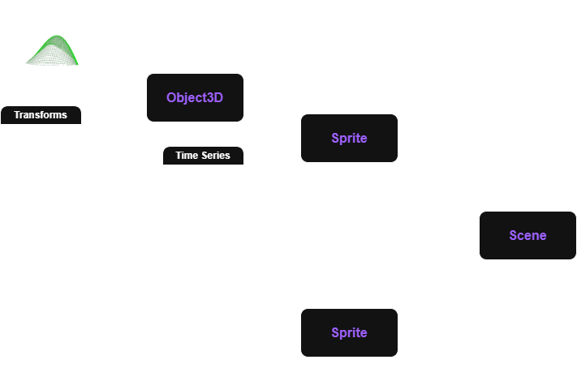

.. _methodology:

Methodology
===========

The **Flapkine** application is a Python-based open-source framework designed to simulate **flexible flapping dynamics** in biomimetic systems. It combines object-oriented architecture, STL-based geometry, and user-defined kinematic models to create rich, interactive 3D simulations.

Flapkine is structured into modular components, each specializing in a distinct stage of simulation — from object loading and transformation to scene assembly and time-series playback.

.. contents::
   :local:
   :depth: 1

Purpose & Design
----------------

The core design philosophy of Flapkine is to offer an **intuitive, reusable, and flexible simulation framework** for dynamic modeling of flapping systems. The software manipulates triangulated STL mesh data using **custom transformation pipelines**, including:

- Rigid body transformations (translation + rotation)
- Deformable transformations (flexible flapping motion)
- Time-dependent playback via animation logic

Its GUI offers researchers a no-code interface to interactively define, preview, and export kinematic models.

Core Components
---------------

.. list-table:: Main Object-Oriented Components
   :widths: 25 75
   :header-rows: 1

   * - Component/Class
     - Description
   * - ``Object3D``
     - Holds STL mesh, name, and transformation pipeline. Applies translation, rotation, and deformation for flexible object simulation.
   * - ``Sprite``
     - Encapsulates time-series data for a single ``Object3D``. Stores dynamic parameters like position of body frame origin, Euler angles, and deformation.
   * - ``Scene``
     - Aggregates multiple ``Sprite``. Used to simulate systems with interacting components (e.g., insect wings).

These classes are usable independently in Python scripts, and their logic is also exposed via the GUI.

   **Figure:** Object-oriented structure of the Flapkine backend — how Object3D, Sprite, and Scene classes interact.

.. _reference_frames:

Reference Frames
----------------

FlapKine uses two primary reference frames to define and apply transformations to 3D objects:

Inertial Frame
^^^^^^^^^^^^^^

The **inertial frame** is the fixed, global coordinate system in which the entire simulation is defined.
Each project contains exactly one inertial frame, associated with the single `Scene` object:

- **Notation**: :math:`\{O_{E}, \hat{\mathbf{e}}_{1}, \hat{\mathbf{e}}_{2}, \hat{\mathbf{e}}_{3}\}`

  - :math:`O_{E}` is the origin of the inertial frame.

  - :math:`\hat{\mathbf{e}}_{1}, \hat{\mathbf{e}}_{2}, \hat{\mathbf{e}}_{3}` are its unit basis vectors.

Body Frame
^^^^^^^^^^
The **body frame** is the local coordinate system attached to each `Object3D` and defined by the STL mesh:

- **Notation**: :math:`\{O_{B}, \hat{\mathbf{b}}_{1}, \hat{\mathbf{b}}_{2}, \hat{\mathbf{b}}_{3}\}`

  - :math:`O_{B}` is the origin of the body frame.

  - :math:`\hat{\mathbf{b}}_{1}, \hat{\mathbf{b}}_{2}, \hat{\mathbf{b}}_{3}` are its unit basis vectors.

- If no initial alignment in :ref:`Sprite Creator Window <sprite_creator_window>` is specified, the body frame coincides with the inertial frame.

Mesh Representation
-------------------
Each STL file describes a triangular mesh via:

- **Vertices**
  Points in 3D space defining the mesh geometry.
- **Connection Relations**
  Triplets of vertex indices that form the mesh’s triangular faces.
  As long as the object remains intact, these relations do not change during the simulation.

Vertices are expressed in homogeneous coordinates in the body frame as:

.. math::

   \mathbf{P}_{B} =
   \begin{bmatrix}
   x_{B} \\
   y_{B} \\
   z_{B} \\
   1
   \end{bmatrix}

During simulation, these vertices are transformed by the pipeline defined in `Object3D`.
See :doc:`Transform Reference <transform_reference>` for full details.

Conceptual Analogy
------------------
To intuitively understand Flapkine’s architecture, imagine the simulation as a **3D stage**:

- The **Scene** is the overall 3D space — it’s the "world" or environment where everything happens. It contains multiple actors (objects), lights, and camera perspectives.
- An **Object3D** is a static 3D model — like a prop or structure on the stage. It knows its shape (via STL mesh), name, and transformation capabilities.
- A **Sprite** is an **Object3D in motion** — it represents that object undergoing transformations over time (translation, rotation, deformation). It’s the actor performing on stage.
- The **Scene** is thus a **collection of Sprites**, each of which combines an Object3D and its motion sequence (e.g., wing flap trajectory, body tilt, etc.).

This hierarchy forms a **modular structure**:

.. code-block::

   Scene
   ├── Sprite 1 → (Object3D + Motion)
   ├── Sprite 2 → (Object3D + Motion)
   └── Sprite N → (Object3D + Motion)

Each level adds more complexity:

- `Object3D` → static geometry + transformations

- `Sprite`   → adds time-based behavior

- `Scene`    → brings everything together in a dynamic simulation

This layered structure makes it easy to manage and visualize multiple interacting elements in a biomimetic system, such as both wings of an insect or multiple appendages in robotics.

Graphical User Interface (GUI) Overview
---------------------------------------

Flapkine includes a fully-featured **graphical user interface** designed to simplify 3D simulation setup and visualization, especially for researchers and users without programming backgrounds.

Key capabilities of the GUI:

- **Import STL Meshes:** Load CAD models (STL format) into the simulation environment.
- **Assign Transformations:** Apply mathematical transformations — through time-series data files.
- **Camera & Lighting Configuration:** Adjust view angles, lighting sources, and projection styles.
- **Export Outputs:** Render scenes into frame sequences or full-length video files.

For a breakdown of all individual windows and their functionalities, see the :doc:`Window Reference <window_reference>` section.

---

Open-Source Architecture & Extendability
----------------------------------------
Flapkine is built from the ground up to be:

- **Fully Open Source:** Licensed under a permissive open-source license to encourage academic and industrial collaboration.
- **Modular and Extensible:** Add custom transformation models, extend GUI windows, or replace back-end rendering logic with ease.
- **Hybrid Architecture:** Use Flapkine from the GUI **or** via Python scripts and command-line tools.
- **Research-Ready:** Designed for reproducibility, publication-quality figures, and scientific visualization workflows.

For details on mathematical models (e.g., forward kinematics, axis projections, and deformation strategies), :doc:`Transform Reference <transform_reference>`.

