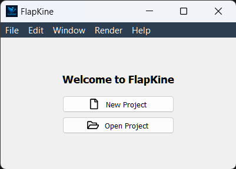

Main Window
===========

Overview
--------

The **Main Window** is the entry point to the Flapkine application. It allows you to either start a new project or load an existing one.

Buttons
-------

- **New Project**
  Launches the Project Creator interface where you can import or create a scene and configure render settings.

- **Open Project**
  Opens an existing project directory from your filesystem and loads its saved STL model, render settings, and animation (if available).

Navigation
----------

Once a project is selected or created, the interface redirects you to the :doc:`Project Editor Window <project_editor>`.

If create project option is selected the interface redirects you to the :ref:`Project Creator Window <project_creator_window>`.
