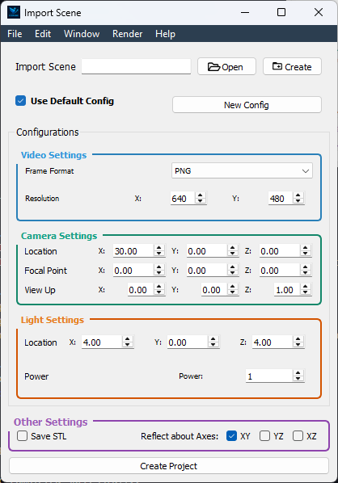

.. _project_creator_window:

🪟 Project Creator Window
=========================

Overview
--------

Kick off your FlapKine projects by setting up the scene and render parameters.

---

Scene Setup
-----------

- **Create New Scene**  
  Initialize a fresh `.pkl` scene from scratch.
  
- **Import Scene**  
  Load an existing `.pkl` scene file into the project.

---

Render Configuration
--------------------

- **Load Default Settings**  
  - Toggle **“Load Default Render Settings”** to apply FlapKine’s recommended parameters automatically.  
  - Individual parameters remain editable if you want to fine‑tune.
  
- **New Render Configuration**  
  - Select this option to start with all render parameters set to zero.  
  - Manually adjust each field to craft a custom setup.

> _See the Render Configuration section for detailed explanations of each parameter._

---

Create Project
--------------

1. Confirm your scene selection and render settings.  
2. Click **Create Project**.  
3. FlapKine will generate your project folder, write the config and data files, then open the **Project Editor Window** for further work.
