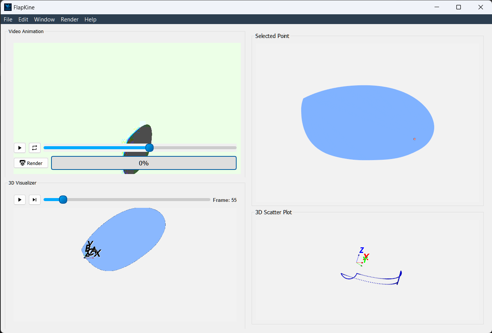

.. _project_editor_window:

Project Editor Window
=====================

Overview
--------

The **Project Editor** serves as the heart of FlapKine, where users interact with STL scenes, fine-tune animations, and analyze motion data via integrated visualization tools.

---

Interface Overview
------------------

.. list-table::
   :widths: 25 75
   :header-rows: 1

   * - **Section**
     - **Purpose**
   * - 🎥 **Video Animation**
     - Renders and displays the animation preview
   * - 🧊 **3D Visualizer**
     - Plays the STL model animation interactively
   * - 🎯 **Selected Point**
     - Enables precise 2D point selection on model surfaces
   * - 📊 **Scatter Plot**
     - Illustrates the 3D motion trajectory of selected points

---

Video Preview Widget
---------------------

- **Overview:**
  Automatically shows the rendered animation if available. Otherwise, users can render the animation using the Render button.

- **Key Features:**
  - **Render Trigger:** Initiates the animation render if it hasn't been completed.
  - **Status Bar:** Displays real-time rendering progress beside the Render button.
  - **Configurable Rendering:** Adjust render settings via the `Render → Configure Render` menu.

---

3D Visualizer Widget
--------------------

- **Overview:**
  Renders the STL model in motion, providing an interactive 3D experience.

- **Key Features:**
  - **Interactive Controls:** Rotate, zoom, and pan using the mouse.
  - **Playback Controls:** Play, pause, or scrub through the animation timeline.
  - **Visualization Aid:** Helps set camera and lighting configurations for the final video render.
  - **Coordinate Axes:** Displays both body-fixed axes (A, B, C) and inertial axes (X, Y, Z).

---

Point Selector Widget
---------------------

- **Overview:**
  Optimized for components like wings where one dimension is significantly smaller; it provides a 2D projection by excluding the smallest axis.

- **Key Features:**
  - **Flattened Projection:** Automatically adjusts to produce a 2D view for easier point selection.
  - **Adaptive Interface:** Works intelligently for both wing-like structures and other object geometries.

---

Scatter Plot Widget
-------------------

- **Overview:**
  Uses computed forward kinematics to plot the 3D motion of the selected point with respect to the inertial coordinate system (X, Y, Z).

- **Key Features:**
  - **Trajectory Tracking:** Visualizes the motion path in 3D space over time.
  - **Dynamic Analysis:** Ideal for examining oscillations, vibrations, and deformation patterns.
  - **Inertial Axes Reference:** The plot is aligned with the inertial axes (X, Y, Z), providing a global frame of reference for motion.
